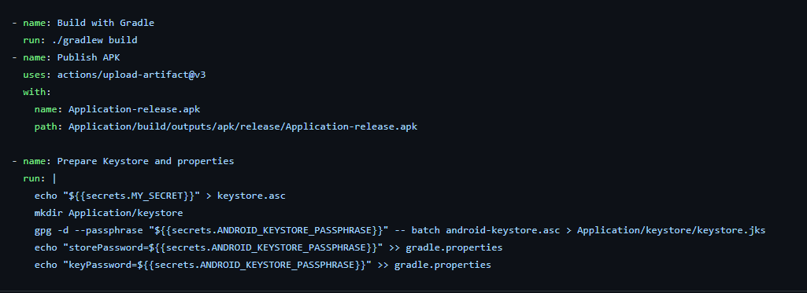

Die schritte in der Übung wurden befolgt 
die signatur wurde überprüft
der key wurde erstellt
Die github Actions wurden angepasst

Wegen der local Variablen war es nicht möglich die Apk zu bauen
Da die gitignore zu spät erstellt wurde sind einige dateien wie local properties gepusht worden, die zu eigen fehlern geführt haben
Habe mittles gpg -c --armor keystore ein Secret erstellt

