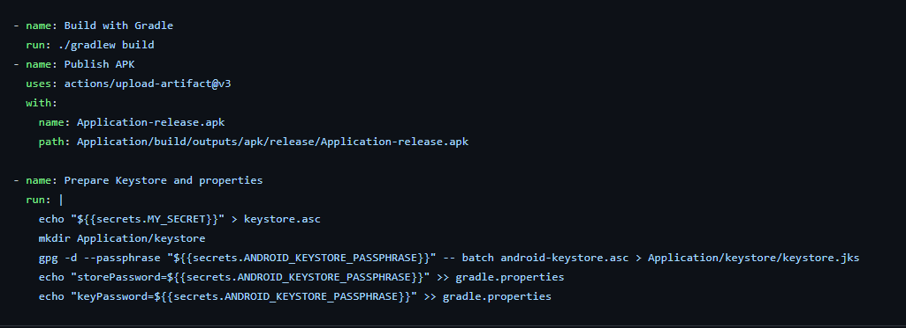

# CI-CD Übungsaufgabe 04

Dieses Projekt dient dazu, in die CI/CD-Inhalte für Android-Apps einzusteigen und zu lernen.

## About
- Continuous Delivery
- WS 22/23
- MSD20
- FH Joanneum

### Gruppe
- Tobias Kogler
- Mario Radman

### Projekt-Details
Das Projekt basiert auf der *Android BasicMultitouch Sample* App. Eine eigene Readme dafür existiert welche man zuerst lesen sollte.
[README der App](docs/readme.md)

## ÜBUNGSTEIL 1 – BEISPIEL PROJEKT LOKAL BUILDEN

Die schritte in der Übung wurden befolgt:
- App wurde in Android Studio gestartet
- Signatur wurde zur App hinzugefügt:

```
 signingConfigs {
    debug {
         storeFile file(path/to/keystore.jks')
         storePassword findProperty('storePassword')
         keyPassword findProperty('keyPassword')
         keyAlias 'keyAlias'
     }
     release {
        ...
     }
 }
```

- Signatur wurde überprüft
```jarsigner -verify -verbose -certs my_application.apk```
- Der key wurde erstellt



Wegen der local Variablen war es nicht möglich die Apk zu bauen
Da die gitignore zu spät erstellt wurde sind einige dateien wie local properties gepusht worden, die zu eigen fehlern geführt haben
Deshalb wurde mit ```gpg -c --armor keystore``` ein Secret erstellt


## ÜBUNGSTEIL 2 – BEISPIEL PROJEKT AUF GITHUB PUSHEN

Die github Actions wurden angepasst und ein zusätzlicher workflow erstellt zum publishen der APK.

## ÜBUNGSTEIL 3 – FERTIGSTELLUNG DEPLOY / DELIVERY WORKFLOWS

Aufgrund Probleme mit dem GRADLE-File nicht möglich


